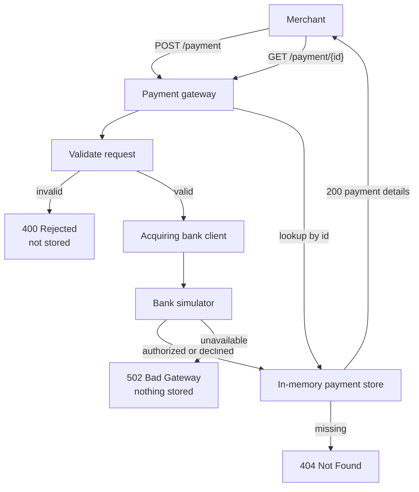

# Payment Gateway Design considerations

## Overview

This payment gateway exposes two merchant endpoints:

- `POST /payment` — validate and process a card payment via the acquiring bank simulator
- `GET /payment/{id}` — retrieve a previously processed payment by id

Storage uses the provided in-memory `PaymentsRepository` test double. No real database is required for this exercise.

## Architecture

The gateway validates every payment before it calls the bank. Invalid input is rejected and not stored. A successful bank call is stored with the last four card digits only, then returned to the merchant. A later GET reads that same record.

## API design

| Outcome                                                 | HTTP status       | Body                                                                         |
| ------------------------------------------------------- | ----------------- | ---------------------------------------------------------------------------- |
| Authorized / Declined                                   | `200 OK`          | Payment details (`id`, `status`, last four digits, expiry, currency, amount) |
| Rejected (invalid input)                                | `400 Bad Request` | `{ "status": "Rejected", "message": "..." }`                                 |
| Payment not found                                       | `404 Not Found`   | `{ "message": "Payment record not found" }`                                  |
| Bank unavailable (5xx, e.g. 503 from simulator)         | `502 Bad Gateway` | `{ "message": "Acquiring bank is unavailable" }`                             |
| Bank refused the request (4xx)                          | `502 Bad Gateway` | `{ "message": "Payment could not be processed by the acquiring bank" }`      |
| Bank could not be reached (timeout, connection refused) | `502 Bad Gateway` | `{ "message": "Failed to call acquiring bank" }`                             |

Rejected payments are **not** stored, matching the requirement that no payment could be created when invalid information is supplied.

Full card numbers and CVVs are never persisted or returned. Only the last four card digits are stored and exposed.

## Validation

Gateway validation runs **before** calling the bank:

- Card number: required, 14–19 digits
- Expiry month: 1–12
- Expiry month + year: must not be before the current month (cards are treated as valid through the end of their expiry month)
- Currency: exactly 3 characters, restricted to `GBP`, `USD`, `EUR` (at most three ISO codes as required)
- Amount: required positive integer in minor currency units. A fractional JSON number such as `200.10` is rejected while the body is read, before validation, so it cannot be truncated and stored.
- CVV: required, 3–4 digits

## Acquiring bank integration

The bank simulator is called at `{bank.simulator.url}/payments` (default `http://localhost:8080/payments`) using the configured `RestTemplate`.

Request mapping:

- Merchant `expiry_month` / `expiry_year` → bank `expiry_date` as `MM/YYYY`
- Full `card_number`, `currency`, `amount`, and `cvv` forwarded as required by the simulator

Response mapping:

- `authorized: true` → `Authorized`
- `authorized: false` → `Declined`
- Non-2xx responses (including simulator `503` for cards ending in `0`) → `502 Bad Gateway`; nothing is stored

## Assumptions

1. In-memory storage is sufficient and process-local (data is lost on restart).
2. ~~Merchant request field names use snake_case (~~`card_number`~~,~~ `expiry_month`~~, etc.). Remove??~~
3. ~~Response field names follow the existing skeleton’s camelCase JSON (~~`cardNumberLastFour`~~, etc.).~~
4. Amount of `0` or negative is invalid.???
5. Bank `400` responses are treated the same as other bank failures (`502`), because the gateway should have already rejected invalid merchant input.
6. ~~ConcurrentHashMap was not introduced; the provided~~ `HashMap` ~~repository is kept as-is for simplicity.~~
7. Rejected status means no payment is stored right? in my code I assumed this case.

## Testing approach

- Controller/integration tests with `MockMvc` and a mocked `AcquiringBankClient` cover Authorized, Declined, Rejected, bank unavailable, GET-by-id, and GET-after-POST.
- Unit tests cover validation rule edge cases in `PaymentRequestValidator`.

To exercise the real simulator locally: `docker-compose up`, start the app, then `POST` to `http://localhost:8090/payment`.