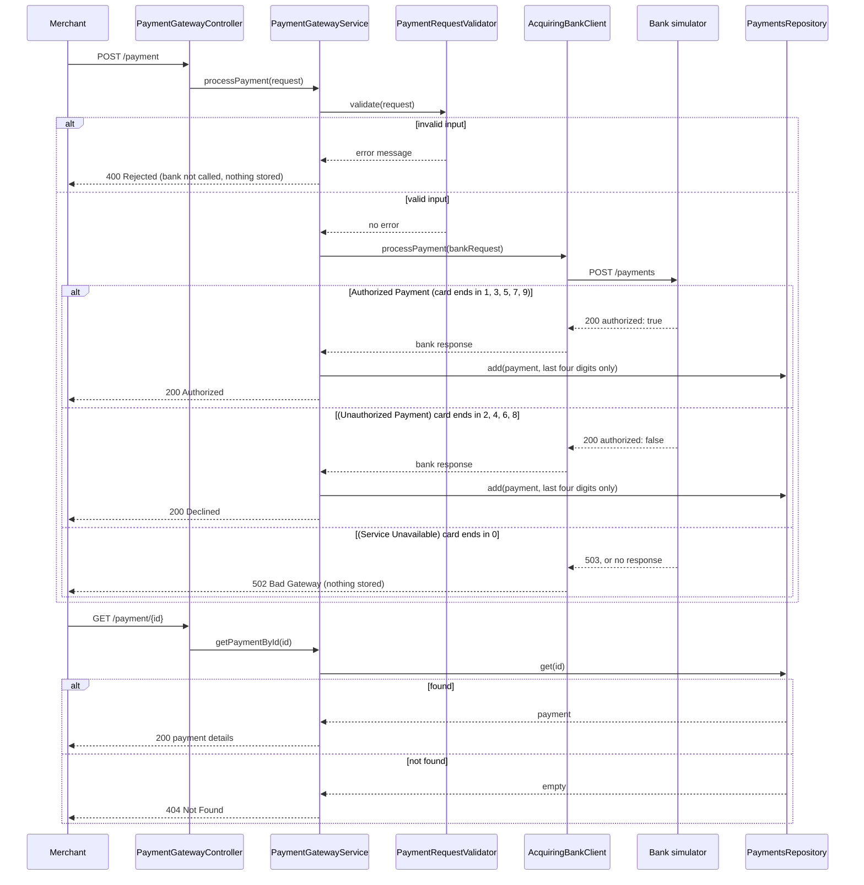

```mermaid
sequenceDiagram
  participant M as Merchant
  participant C as PaymentGatewayController
  participant S as PaymentGatewayService
  participant V as PaymentRequestValidator
  participant B as AcquiringBankClient
  participant Sim as Bank simulator
  participant R as PaymentsRepository

  M->>C: POST /payment
  C->>S: processPayment(request)
  S->>V: validate(request)
  alt invalid input
    V-->>S: error message
    S-->>M: 400 Rejected (bank not called, nothing stored)
  else valid input
    V-->>S: no error
    S->>B: processPayment(bankRequest)
    B->>Sim: POST /payments
    alt Authorized Payment (card ends in 1, 3, 5, 7, 9)
      Sim-->>B: 200 authorized: true
      B-->>S: bank response
      S->>R: add(payment, last four digits only)
      S-->>M: 200 Authorized
    else (Unauthorized Payment) card ends in 2, 4, 6, 8
      Sim-->>B: 200 authorized: false
      B-->>S: bank response
      S->>R: add(payment, last four digits only)
      S-->>M: 200 Declined
    else (Service Unavailable) card ends in 0
      Sim-->>B: 503, or no response
      B-->>M: 502 Bad Gateway (nothing stored)
    end
  end

  M->>C: GET /payment/{id}
  C->>S: getPaymentById(id)
  S->>R: get(id)
  alt found
    R-->>S: payment
    S-->>M: 200 payment details
  else not found
    R-->>S: empty
    S-->>M: 404 Not Found
  end
```

